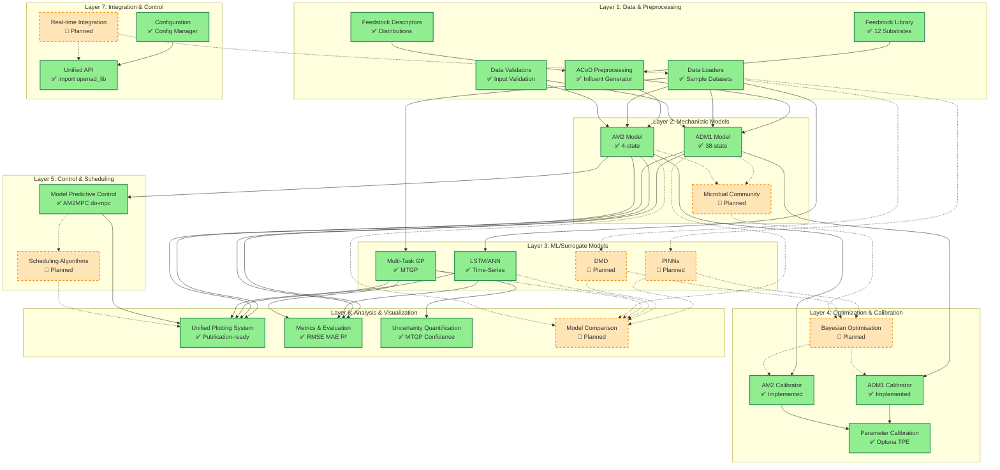

# OpenAD-lib Architecture Diagram

## Complete System Architecture



---

## Architecture Layers Explained

### Layer 1: Data & Preprocessing ✅
**Purpose**: Handle raw data inputs and transform them for modeling

- **✅ Feedstock Library**: 12 common AD substrates with composition data
- **✅ Feedstock Descriptors**: Statistical distributions for uncertainty
- **✅ ACoD Preprocessing**: Generate ADM1 influent from feedstock mix
- **✅ Data Loaders**: 6 sample datasets (AM2 lab, LSTM, biogas, etc.)
- **✅ Data Validators**: Input validation and quality checks

---

### Layer 2: Mechanistic Models ✅ / 🔄
**Purpose**: Physics-based process models

- **✅ ADM1**: Full 38-state model (BSM2 compliant)
- **✅ AM2**: Simplified 4-state model for fast simulation/control
- **🔄 Microbial Community**: Detailed microbial dynamics (planned)

---

### Layer 3: ML/Surrogate Models ✅ / 🔄
**Purpose**: Data-driven alternatives with speed/uncertainty benefits

**Current (✅)**:
- **MTGP**: Multi-Task Gaussian Process with uncertainty
- **LSTM**: Time-series neural network

**Planned (🔄)**:
- **PINNs**: Physics-Informed Neural Networks
- **DMD**: Dynamic Mode Decomposition

---

### Layer 4: Optimization & Calibration ✅ / 🔄
**Purpose**: Parameter tuning and model improvement

**Current (✅)**:
- **Parameter Calibration**: Optuna with TPE algorithm
  - ADM1Calibrator
  - AM2Calibrator

**Planned (🔄)**:
- **Bayesian Optimisation**: GP-based hyperparameter tuning
  - Gaussian Process surrogate
  - Acquisition functions (EI, UCB, PI)

---

### Layer 5: Control & Scheduling ✅ / 🔄
**Purpose**: Real-time process optimization

**Current (✅)**:
- **AM2MPC**: Model Predictive Control with do-mpc
  - Biogas maximization
  - VFA tracking
  - Constraint handling

**Planned (🔄)**:
- **Scheduling Algorithms**: Multi-objective feedstock scheduling
  - Production optimization
  - Cost minimization
  - Genetic algorithms

---

### Layer 6: Analysis & Visualization ✅ / 🔄
**Purpose**: Understand and communicate results

**Current (✅)**:
- **Unified Plotting**: Consistent publication-ready figures
  - `plot_predictions()`
  - `plot_multi_output()`
  - `plot_calibration_comparison()`
  - `plot_mpc_results()`
- **Metrics**: RMSE, MAE, R²
- **Uncertainty Quantification**: MTGP confidence intervals

**Planned (🔄)**:
- **Model Comparison Framework**: Side-by-side benchmarking

---

### Layer 7: Integration & Control ✅ / 🔄
**Purpose**: User interface and system coordination

**Current (✅)**:
- **Configuration Manager**: Centralized settings
- **Unified API**: `import openad_lib as openad`

**Planned (🔄)**:
- **Real-time Integration**: Streaming data support

---

## Technology Stack

### Current Dependencies ✅
```python
# Core Scientific Computing
numpy >= 1.20
scipy >= 1.7
pandas >= 1.3

# Machine Learning
torch >= 1.9           # LSTM, PINNs (future)
gpytorch >= 1.5        # Multi-Task GP

# Optimization
optuna >= 3.0          # Parameter calibration (current)
# scikit-optimize      # Bayesian Opt (planned)

# Control
do-mpc >= 4.0          # Model Predictive Control
casadi >= 3.5          # Optimization backend

# Visualization
matplotlib >= 3.4      # Static plots
plotly >= 5.0          # Interactive plots

# Data
scikit-learn >= 0.24   # Preprocessing, metrics
openpyxl >= 3.0        # Excel reading
```

---

## Legend

**✅ Current**: Implemented and working (solid lines in diagram)
**🔄 Planned**: Future development (dashed lines in diagram)

---

## Usage Examples by Layer

### Data Preprocessing
```python
import openad_lib as openad

# Current ✅
data = openad.load_sample_data('am2_lab')
influent = openad.acod.generate_influent_data('feedstock.csv')
```

### Models
```python
# Current ✅
adm1 = openad.ADM1Model()
am2 = openad.AM2Model()
lstm = openad.LSTMModel()
mtgp = openad.MultitaskGP()

# Planned 🔄
# pinn = openad.PINNModel()
# dmd = openad.DMDModel()
```

### Optimization
```python
# Current ✅ - Optuna
calibrator = openad.AM2Calibrator(model)
params = calibrator.calibrate(n_trials=50)

# Planned 🔄 - Bayesian Opt
# bo_calibrator = openad.BayesianOptimizer(model)
# params = bo_calibrator.optimize(acquisition='EI')
```

### Control
```python
# Current ✅
mpc = openad.AM2MPC(model)
control = mpc.solve()

# Planned 🔄
# scheduler = openad.FeedstockScheduler()
# schedule = scheduler.optimize_weekly()
```

### Visualization
```python
# Current ✅
openad.plots.plot_multi_output(y_true, y_pred)
openad.plots.plot_calibration_comparison(before, after)

# Planned 🔄
# openad.plots.plot_model_comparison([adm1, am2, lstm])
```

---

## Development Priorities

**Phase 1 (Current - v0.2.0)**: ✅
- All mechanistic models
- Basic ML (LSTM, MTGP)
- Optuna calibration
- AM2 MPC
- Unified plotting

**Phase 2 (v0.3.0 - Next 3 months)**: 🔄
- Testing infrastructure
- Documentation (MkDocs)
- PINNs implementation
- Bayesian Optimization

**Phase 3 (v0.4.0 - 6 months)**: 🔄
- DMD surrogate
- Advanced scheduling
- Model comparison framework
- Real-time integration

**Phase 4 (v1.0.0 - Production)**: 🔄
- Microbial community module
- Industry validation
- Stable API guarantee
