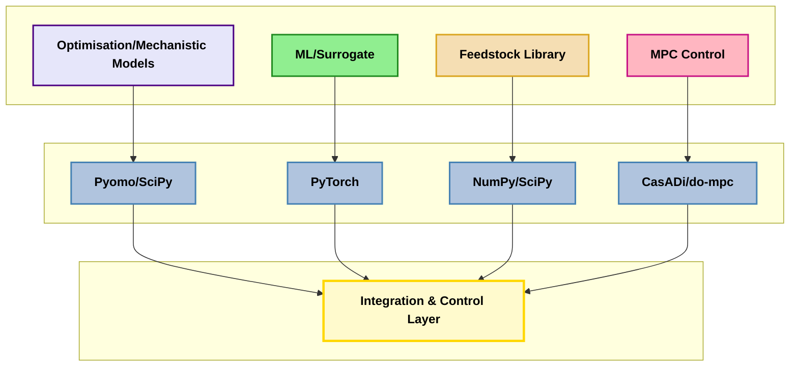
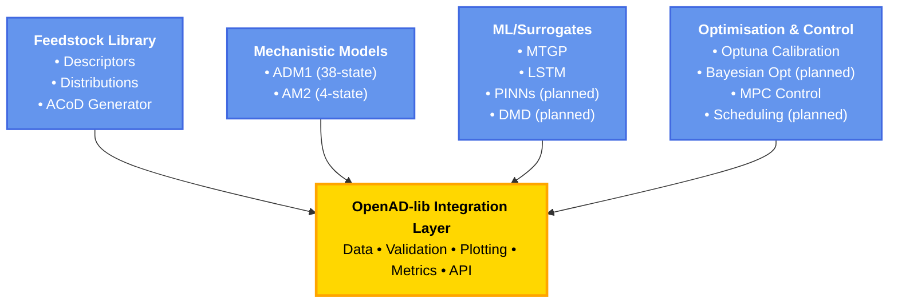
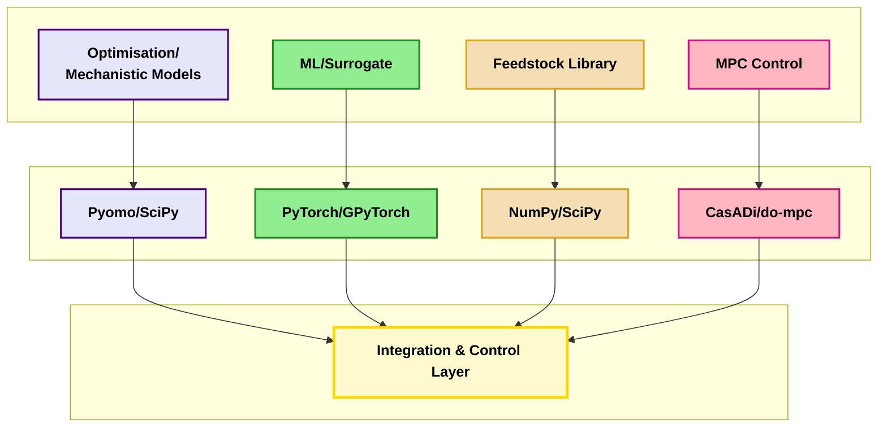

# OpenAD-lib Publication Diagrams (Mermaid)

## Diagram 1: Technology Stack Architecture



### Key Components:
- **Pyomo/SciPy**: ADM1, reduced models, optimization formulations
- **PyTorch**: ANNs, LSTMs, MTGP, PINNs, differentiable programming
- **NumPy/SciPy**: Feedstock descriptors, distributions, ACoD processing
- **CasADi/do-mpc**: Nonlinear MPC, constraint handling, real-time control
- **Integration**: Seamless hybrid workflows with uncertainty propagation

---

## Diagram 2: Simplified Component Overview



---

## Diagram 3: Detailed Technology Stack (4 Pillars)



---

## Usage Notes

**For LaTeX/Papers**:
- Copy Mermaid code into [Mermaid Live Editor](https://mermaid.live)
- Export as PNG/SVG with transparent background
- Insert into LaTeX using `\includegraphics{}`

**For Markdown/GitHub**:
- Paste Mermaid code directly - renders automatically
- Works in README.md, documentation, GitHub Issues

**For Presentations**:
- Export as high-resolution PNG from Mermaid Live
- Use SVG for vector graphics (scales perfectly)

**Color Scheme**:
- Purple: Optimisation/Mechanistic (SciPy-based)
- Green: ML/Surrogates (PyTorch-based)  
- Beige: Feedstock/Data (NumPy-based)
- Pink: MPC Control (CasADi-based)
- Yellow: Integration Layer

---

## Customization Tips

### Change Colors
```mermaid
classDef myClass fill:#COLOR,stroke:#BORDER,stroke-width:2px
class NodeName myClass
```

### Add More Details
```mermaid
NODE["<b>Title</b><br/>• Item 1<br/>• Item 2"]
```

### Adjust Layout
```
TB (top-to-bottom)
LR (left-to-right)  
RL (right-to-left)
BT (bottom-to-top)
```
